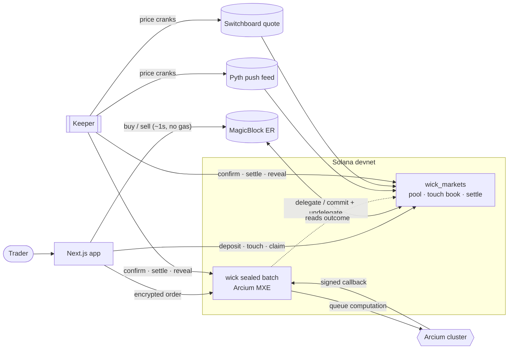
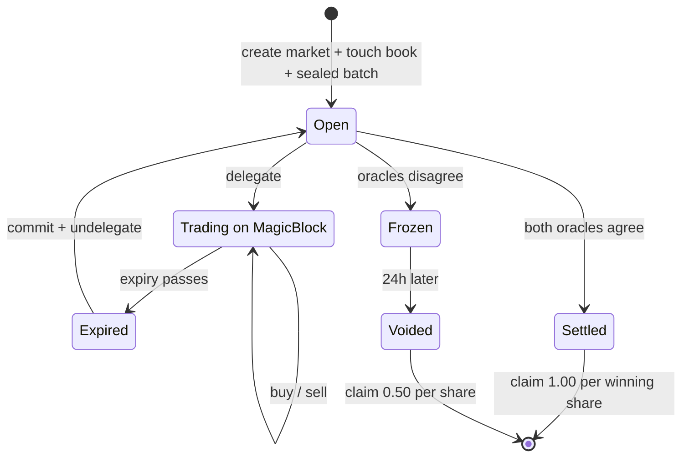
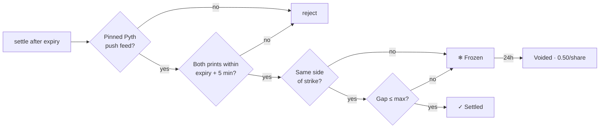
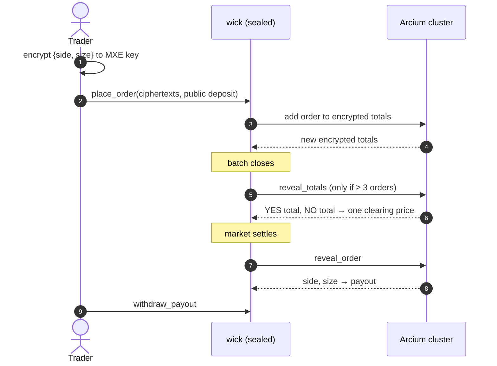

<div align="center">

# 🕯️ Wick

**Trade the wick, not just the close.**

Prediction markets on Solana with instant trading on MagicBlock, touch bets on the price path, and sealed Arcium batches.
Every payout requires **Pyth and Switchboard to agree**.

</div>


## What it is

Every Wick market asks one question: *"Will SOL be ≥ $123 at Friday 17:00?"* You can take that view three ways:

| | Mode | What you're betting on | Runs on |
|---|---|---|---|
| ⚡ | **Instant** | YES/NO shares against an FPMM pool. Buy and sell anytime, ~1s, no gas | MagicBlock ephemeral rollup |
| 🔥 | **Touch** | *"Does SOL trade through $125 before expiry?"* Pays the moment it happens | Solana, backed by a house vault |
| 🔒 | **Sealed** | Encrypted side and size, filled at one clearing price. Nobody sees your order | Arcium MPC |

| Touch bets and the live chart | Sealed batch |
|---|---|
|  |  |

## How it works



- **`wick_markets`** (Anchor) holds markets, the FPMM pool, touch books, dual-oracle settlement, and MagicBlock delegation.
- **`wick`** (Arcium MXE) runs the sealed batch and reads each market's outcome from `wick_markets`.
- **The keeper** refreshes both oracles and runs every permissionless crank: confirming touches, undelegating, settling, revealing, and paying sealed orders. Anyone can run these; the keeper just saves users the clicks. It also keeps a line-up of markets live, opening a new market (with sequential ids, so the app finds it automatically) whenever one runs out.

### Market lifecycle



### Dual-oracle settlement



**Pyth** is a Wormhole-verified push feed. **Switchboard** is an Ed25519-verified oracle quote built only from Coinbase, Kraken and Bitstamp, so it doesn't depend on Pyth. If they disagree, the market **freezes** instead of paying the wrong side.

### Touch bets

A ticket's price is the driftless one-touch probability plus a house edge:

```
P(touch)      = 2 · (1 − Φ( |ln(level / spot)| / (σ·√T) ))
P(↑ before ↓) = min( ln(spot/low) / ln(high/low),  P(touch high) )
```

When you buy a ticket, its full payout is locked in the house vault, so the book can't go insolvent. A ticket wins only when **both** oracles print through the level within 30 seconds of each other.

### Sealed batch



Orders stay sealed for the whole life of the market. Only the batch totals are revealed at close, and everyone fills at `YES_total / (YES_total + NO_total)`. Each order is opened only after resolution, to pay it out.

## Security model

| Threat | Mitigation |
|---|---|
| One oracle is wrong or manipulated | Both must agree on side and within the max gap, or the market freezes |
| Settler picks a favourable print | Only the market's pinned Pyth push feed, printed within 5 minutes of expiry; a freeze can still resolve if they agree later in the window |
| Stale touch quotes | Quotes use the pinned push feed (≤20s old) and price off whichever oracle is less favourable to the buyer |
| A wick seen by one feed only | Touches need both oracles, within 30s of each other |
| House insolvency | Full payout is reserved at purchase; capacity is checked on-chain |
| Funds stuck in a frozen market | Anyone can void after 24h; shares redeem at 0.50, fully backed |
| Small sealed batches leak orders | Totals are revealed only with ≥ 3 orders; otherwise a full refund with nothing revealed. (Sybil orders can still shrink the anonymity set; this is a known limit of batch privacy.) |
| Late MPC callbacks | Callbacks must match the batch's pending order and the expected state |
| Batch squatting | Only the market creator can open its sealed batch |
| Near-certain touch tickets | Quotes above 95% are refused, not clamped |
| "↑ before ↓" order disputes | Its confirmations must use prints under 20s old, so the order of events is fixed in real time |
| Stuck MPC computations | Order payouts, batch reveals and inits can all be re-queued after a timeout |

> These are unaudited devnet contracts using a test USDC mint.

## Verified on devnet

A full lifecycle ran against devnet with scripted users:

- **Instant:** deposit, delegate, then buy and sell on MagicBlock in about 1 second each.
- **Touch:** tickets priced on-chain; 3 were confirmed as winners when both oracles printed through the level.
- **Settlement:** the market settled NO on Pyth $122.874 and Switchboard $122.88, 34 seconds after expiry.
- **Sealed:** 3 encrypted orders; Arcium revealed only the totals (YES $30, NO $15, clearing at 66.7¢); the winning order was paid $55.
- **Claims:** pool, touch and sealed payouts reached the wallet, and the creator's LP claim paid out with the vault staying solvent.

## Devnet deployment

| | Address |
|---|---|
| Markets program | `336JyfBdwevzzuuQ5dy1LF5aQPatq947z6Td6111qxow` |
| Sealed program (Arcium, cluster 456) | `8YY5NCZCPRcRy6tTPq3awnwW84LLe5LgECHNUNfx1wuT` |
| Mint, oracles, markets | [`app/src/deployment.json`](app/src/deployment.json) |

## Repository

```
programs/wick_markets   markets, FPMM pool, touch book, dual-oracle settlement, ER delegation
programs/wick           Arcium sealed batch (MXE program)
encrypted-ixs           Arcis circuits: init_totals, place_order, reveal_totals, reveal_order
app                     Next.js frontend (markets, trading panels, portfolio, /docs)
scripts                 setup · keeper · markets (open/discover) · oracles · status · e2e · claim
```

## Run it

```bash
cp .env.example .env                 # RPC_URL, ER_URL, PYTH_API_KEY, KEYPAIR
yarn && arcium build
cargo test -p wick_markets --lib     # pool, pricing and oracle-parsing tests

yarn setup                           # test USDC mint, oracle accounts, Arcium comp defs, markets
yarn keeper                          # oracle cranks, touch confirmation, settlement, sealed payouts
yarn status                          # one-screen snapshot of every market, batch and ticket
yarn e2e                             # scripted user: deposit → trade → touch → sealed order

cd app && cp .env.example .env.local && pnpm i && pnpm dev
```

Pyth's Hermes has required an API key since the Pyth Core upgrade (Aug 2026). The app proxies it server-side, so the key never reaches the browser.

**Built with:** Anchor · MagicBlock Ephemeral Rollups · Arcium · Pyth · Switchboard On-Demand · Next.js · Tailwind · lightweight-charts
